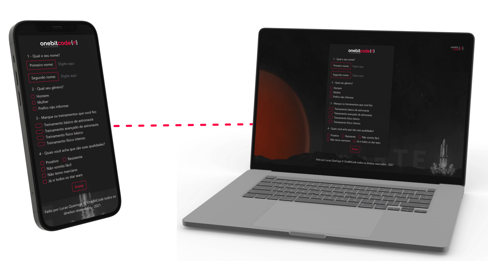

# One Bit Code - OnebitX

> Página construida usando apenas Bootstrap.

Landing page construida na aula de Bootstrap da OneBitCode.

- Formulário
- Manipulção de elementos
- Responsividade

[Clique aqui pra acessar]()

## 🛠 Tecnologias

## ✉ Contato

<a href = "https://t.me/Carloscunha611" target = '_blank'>
